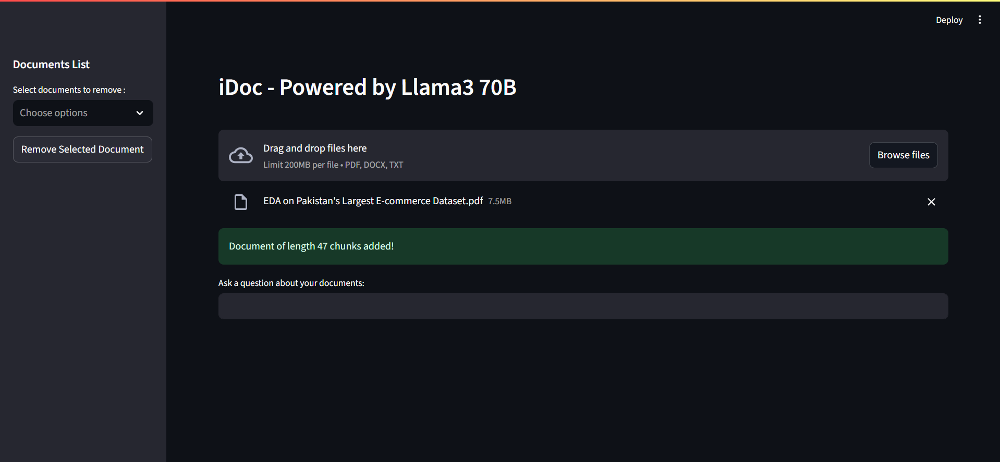
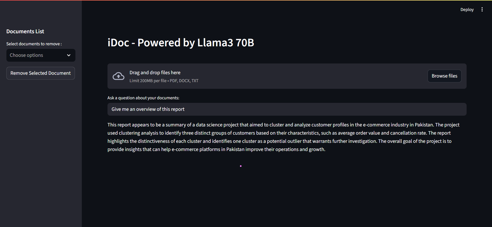
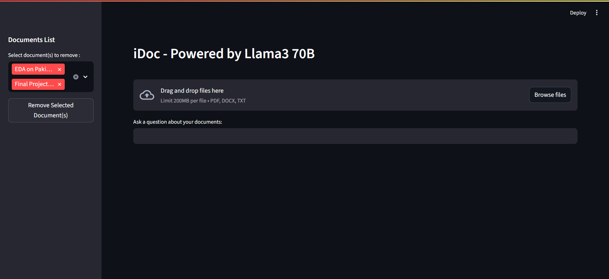

# iDoc: Instant Document QA with RAG  
*Powered by Llama3 & optimized for speed*

  <table>
    <tr>
      <td align="center">
        
      </td>
      <td align="center">
        
      </td>
    </tr>
    <tr>
      <td align="center">
        
      </td>
      <td align="center">
        
      </td>
    </tr>
  </table>

## 🚀 Features
- **Completely Open Source**: No API payments required.
- **Instant Search**: Binary embeddings deliver fast retrieval with minimal accuracy loss  
- **Multi-Format Support**:  
  📄 PDFs  
  📝 Word (.docx)  
  📋 Plain text (.txt)  
- **Self-Contained**: ChromaDB stores vectors locally  
- **Smart Processing**: Dynamic chunking adapts to document complexity
- **Multiple Document Addition/Removal**: Manage your local storage by adding/removing multiple documents 
- **Duplicate Document Identification**: Skips chunking and embedding duplicate documents to save processing time
- **Easily Modifiable**: Swappable embeddings/LLM with minimal code changes. Furthermore, you may edit chunking process according to your own requirements.

## 🛠️ Tech Stack  

| Component       | Technology                               |  
|-----------------|------------------------------------------|  
| LLM             | Llama3-70B (Groq API)                    |  
| Embeddings      | BAAI/BGE-small-en-v1.5 (binary mode)     |  
| Vector Store    | ChromaDB (persists locally)              |  
| Framework       | LangChain                                |  
| UI              | Streamlit                                |  

## ⚡ Quick Start

### Prerequisites
- Python 3.10+
- [Groq API key](https://console.groq.com)

