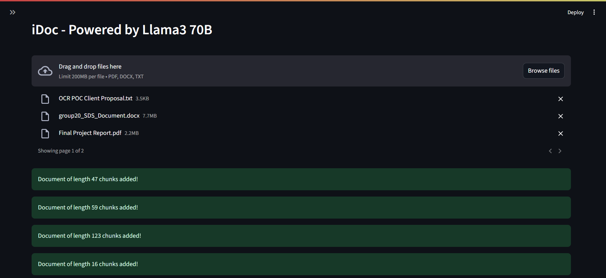

# iDoc: Instant Document QA with RAG  
*Powered by Llama3 & optimized for speed*

<div align="center">
  <table>
    <tr>
      <td align="center">
        <a href="assets/screenshot2.png" target="_blank">
          
        </a>
      </td>
      <td align="center">
        <a href="assets/screenshot3.png" target="_blank">
          
        </a>
      </td>
    </tr>
    <tr>
      <td align="center">
        <a href="assets/screenshot1.png" target="_blank">
          
        </a>
      </td>
      <td align="center">
        <a href="assets/screenshot4.png" target="_blank">
          
        </a>
      </td>
    </tr>
  </table>
</div>

## 🚀 Features
- **Completely Open Source**: No API payments required
- **Instant Search**: Binary embeddings deliver fast retrieval with minimal accuracy loss  
- **Multi-Format Support**:  
  📄 PDFs  
  📝 Word (.docx)  
  📋 Plain text (.txt)  
- **Self-Contained**: ChromaDB stores vectors locally  
- **Smart Processing**: Dynamic chunking adapts to document complexity
- **Duplicate Document Identification**: Skips chunking and embedding duplicate documents to save processing time

## 🛠️ Tech Stack  

| Component       | Technology                  |  
|-----------------|-----------------------------|  
| LLM             | Llama3-70B (Groq API)       |  
| Embeddings      | BGE-small (binary mode)     |  
| Vector Store    | ChromaDB                    |  
| Framework       | LangChain                   |  
| UI              | Streamlit                   |  

## ⚡ Quick Start

### Prerequisites
- Python 3.10+
- [Groq API key](https://console.groq.com)

### Setup
1. Clone the repo:
   ```bash
   git clone https://github.com/yourusername/iDoc.git
   cd iDoc
